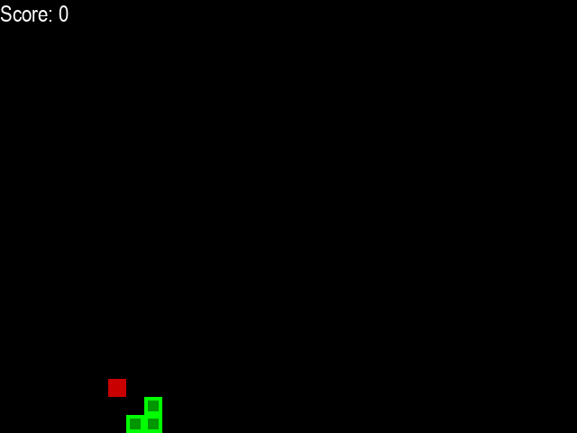
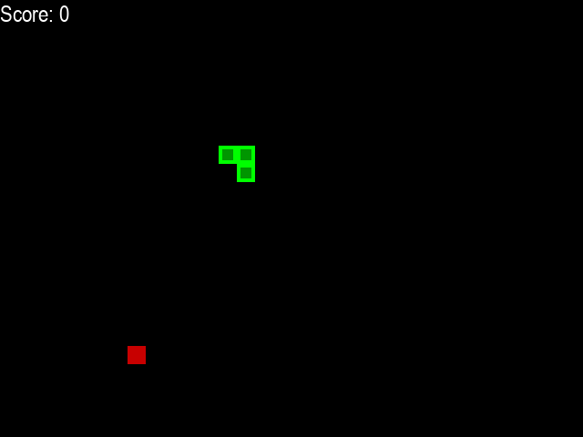

# SnakeAI-DQN


A Deep Q-Network (DQN) implementation for training an AI agent to play the classic Snake game using Reinforcement Learning.

## Table of Contents

- [Overview](#overview)
  - [Reinforcement Learning](#reinforcement-learning)
  - [Deep Q-Networks (DQN)](#deep-q-networks-dqn)
- [Environment and State Representation](#environment-and-state-representation)
  - [State Space](#state-space)
  - [Action Space](#action-space)
  - [Reward System](#reward-system)
- [Prerequisites](#prerequisites)
- [Installation](#installation)
- [Usage](#usage)
  - [Training the Agent](#training-the-agent)
  - [Watching the Trained Agent](#watching-the-trained-agent)
- [Project Structure](#project-structure)
- [Results](#results)
- [Contributing](#contributing)
- [License](#license)
- [Acknowledgments](#acknowledgments)

## Overview

This project implements a Deep Q-Network (DQN) to train an AI agent to play the classic Snake game. The agent learns to play the game by interacting with the environment, observing the state, and learning from rewards and penalties. The implementation uses PyTorch for the neural network, Gym for the environment interface, and Pygame for rendering the game.

### Reinforcement Learning

Reinforcement Learning (RL) is a type of machine learning where an agent learns to make decisions by performing actions in an environment to maximize cumulative rewards. The agent learns a policy that maps states to actions by exploring the environment and receiving feedback in the form of rewards or penalties.

### Deep Q-Networks (DQN)

A Deep Q-Network combines Q-Learning with deep neural networks. It approximates the Q-value function using a neural network, allowing it to handle large or continuous state spaces. The DQN algorithm enables the agent to learn optimal policies in environments with high-dimensional inputs.

## Environment and State Representation

### State Space

The state of the game at any time is represented by an 11-dimensional vector capturing critical information for decision-making:

1. **Danger Straight**: Is there a collision if the agent moves straight?
2. **Danger Right**: Is there a collision if the agent turns right?
3. **Danger Left**: Is there a collision if the agent turns left?
4. **Moving Left**: Is the agent currently moving left?
5. **Moving Right**: Is the agent currently moving right?
6. **Moving Up**: Is the agent currently moving up?
7. **Moving Down**: Is the agent currently moving down?
8. **Food Left**: Is the food located to the left of the agent?
9. **Food Right**: Is the food located to the right of the agent?
10. **Food Up**: Is the food located above the agent?
11. **Food Down**: Is the food located below the agent?

This representation allows the agent to have a simplified view of the environment while retaining essential information to make decisions.

### Action Space

The agent can take one of three possible actions at each time step:

- **[1, 0, 0]**: Move Straight
- **[0, 1, 0]**: Turn Right
- **[0, 0, 1]**: Turn Left

These actions dictate the next direction of the snake based on its current direction.

### Reward System

The reward system is designed to encourage the agent to eat food and avoid collisions:

- **+10**: The agent eats food.
- **-10**: The agent collides with the wall or itself.
- **0**: Any other action (moving without eating food or colliding).

This reward structure incentivizes the agent to learn behaviors that maximize the score by eating food and surviving as long as possible.

## Prerequisites

- Python 3.7 or higher
- [PyTorch](https://pytorch.org/) == 2.4.1
- [Gym](https://www.gymlibrary.dev/) == 0.26.2
- [NumPy](https://numpy.org/) == 1.26.4
- [Pygame](https://www.pygame.org/) == 2.6.1
- [Matplotlib](https://matplotlib.org/) == 3.9.2
- [Imageio](https://imageio.readthedocs.io/) == 2.36.0

## Installation

1. **Clone the Repository**

   ```bash
   git clone https://github.com/levgiorg/SnakeAI-DQN.git
   cd SnakeAI-DQN
   ```

2. **Create a Virtual Environment (Recommended)**

   ```bash
   python -m venv venv
   source venv/bin/activate  # On Windows use `venv\Scripts\activate`
   ```

3. **Install the Requirements**

   ```bash
   pip install -r requirements.txt
   ```

## Usage

### Training the Agent

To train the DQN agent to play Snake, run:

```bash
python main.py
```

Training parameters can be adjusted in the `config/hyperparameters.json` file.

### Watching the Trained Agent

After training, you can watch the agent play the game:

```bash
python watch_agent.py
```

You'll be prompted to select a run number corresponding to the saved models.

## Project Structure

```plaintext
SnakeAI-DQN/
├── agents/
│   ├── __init__.py
│   └── dqn_agent.py
├── config/
│   ├── __init__.py
│   ├── hyperparameters.json
│   └── hyperparameters.py
├── environment/
│   ├── __init__.py
│   ├── direction.py
│   ├── point.py
│   └── snake_environment.py
├── models/
│   ├── __init__.py
│   ├── dqn_trainer.py
│   └── neural_network.py
├── utilities/
│   ├── __init__.py
│   ├── logger.py
│   ├── plotter.py
│   └── replay_memory.py
├── runs/
│   ├── run_1/
│   │   ├── hyperparameters.json
│   │   ├── model.pth
│   │   ├── training_log.csv
│   │   ├── training_plot.png
│   │   ├── early_training.gif
│   │   └── best_episode.gif
│   └── ...
├── main.py
├── watch_agent.py
├── requirements.txt
└── README.md
```

## Results

### Early Training Episode

Below is a GIF showing the agent's performance during the early stages of training:



### After 10,000 Episodes

The agent's performance after 10,000 training episodes:




## Contributing

Contributions are welcome! If you'd like to contribute, please follow these steps:

1. **Fork the Repository**

   Click the "Fork" button at the top right corner of this page to create a copy of this repository under your GitHub account.

2. **Clone Your Fork**

   ```bash
   git clone https://github.com/your-username/SnakeAI-DQN.git
   cd SnakeAI-DQN
   ```

3. **Create a New Branch**

   ```bash
   git checkout -b feature/your-feature-name
   ```

4. **Make Your Changes**

   Implement your feature or fix the issue.

5. **Commit Your Changes**

   ```bash
   git commit -am 'Add new feature'
   ```

6. **Push to Your Fork**

   ```bash
   git push origin feature/your-feature-name
   ```

7. **Open a Pull Request**

   Go to the original repository and open a pull request with a clear description of your changes.

## License

This project is licensed under the MIT License - see the [LICENSE](LICENSE) file for details.

## Acknowledgments

- [PyTorch](https://pytorch.org/)
- [OpenAI Gym](https://www.gymlibrary.dev/)
- [Pygame](https://www.pygame.org/news)
- [Matplotlib](https://matplotlib.org/)
- [NumPy](https://numpy.org/)
- [Imageio](https://imageio.readthedocs.io/)
- Inspiration from various online resources and tutorials.